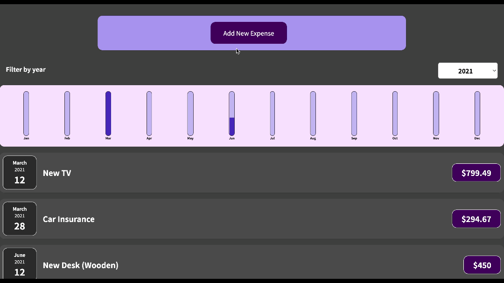

# React Study

Hey! Thanks for checking out my work in studying React. This repo is just that, my dive into several tutorials that teach React. I expect that much of what you see here are near 1 for 1 representations of the work we do through each tutorial. Here are my goals while I udergo this training:

## Goals

1. Keep Notes on important things to remember about coding React Apps
2. Build an organized list of tutorials that I've completed (at lease 25%) for others to review and possibly use. I should also try to provide an "IMHO" review on each.
3. Show some of results of what I was able to complete

## Current Tutorial

React - The Complete Guide (incl Hooks, React Router, Redux)  
By Academind by Maximilian Schwarzmüller  

This is a [Udemy Course](https://www.udemy.com/course/react-the-complete-guide-incl-redux/ "Course Found Here"). So far I've completed one course project. At the time of this writing, it seems like everything is updated. He does an decent job explaining why things should work. I would say that his instruction speed is fast. His code writing will require most people to rewind. He also jumps between files a lot when he's trying to explain how one component effects another. This can be confusing if you are coding along and look up to find the code completely changed.

### Current Tutorial Result Samples

First Course Project

Second Project, using all that has been taught so far.  

Third Project, using useState, useRef, useContext, and useReducer. All design and logic work was created by the instructor. I followed along to produce the same application he provided.  

## Other Tutorials

1. Youtube Course... More to say here...
